<!-- _class: title -->

# AI Agent の監視・最適化・保護 — Microsoft Foundry

### ハンズオン Workshop

**所要時間:** 60 分
**シナリオ:** Contoso Travel — AI 旅行アシスタント

<!--
SPEAKER NOTES:
本 Workshop では、Microsoft Foundry の Observability プラットフォームを実際に体験します。Contoso Travel シナリオを使い、AI Agent の構築・Trace・評価・保護までを一通り実施します。
所要時間: 約 2 分（イントロ）
-->

---

# 本 Workshop について

**課題:** AI Agent を作ること自体は簡単です。それを長期間 *安定的に* 運用し続けることが難しいのです。

Model は更新され、Prompt は改善され、Retrieval パイプラインはドリフトし、本番利用でエッジケースが見つかります。

**解決策:** 問題の _検知_ → _診断_ → _最適化_ まで一気通貫で提供する統合 Observability プラットフォーム。

**本 Workshop の到達目標:**
1. 🔍 OpenTelemetry Trace で Agent の実行を **観測 (Observe)**
2. ⚡ Foundry Skills で Agent のパフォーマンスを **最適化 (Optimize)**
3. 🛡️ Red Teaming スキャンで Agent を攻撃から **保護 (Protect)**
4. 🚀 Agent を **Deploy** し、Ask AI で監視・分析

<!--
SPEAKER NOTES:
AI Agent の難しさは最初のデモではなく、時間が経っても安定して動かし続けることにあります。それを支えるのが Observability です。
所要時間: 約 3 分
-->

---

# Contoso Travel シナリオ

**Contoso Travel** は中規模の旅行代理店で、人間のアドバイザーだけでは予約需要に対応しきれなくなっています。

必要なのは **AI 旅行アシスタント** — 複数の Agent が連携するシステムです:
- 🔎 在庫（ホテル・フライト・レンタカー）の検索
- 💡 パーソナライズされた推薦
- 📝 マルチターン会話による旅程のカスタマイズ提案

> このシナリオを **すべての Lab** で使用し、Agent をゼロから構築→観測→評価→保護していきます。

<!--
SPEAKER NOTES:
シナリオを紹介します。実世界の Agent アプリケーションに共通する現実的なユースケースです。全ステップで同じシナリオを追います。
所要時間: 約 2 分
-->

---

# Workshop の進め方

AI 開発者のジャーニー **計画 → プロトタイプ → 本番** をたどります。

| ステップ | 内容 | ツール |
|:---|:---|:---|
| **1** | インフラ構築 | Foundry Portal |
| **2** | 開発環境セットアップ | GitHub Codespaces |
| **3** | Foundry Skills で観測 | Coding Agent + Skills |
| **4** | SDK でステップバイステップ構築 | Foundry SDK + Notebooks |

### 選べる 2 つのパス
- **共通パス**: Step 1 & 2（両パス共通・必須）
- **Path A**: Step 3 — Coding Agent が評価・最適化ループを自動化
- **Path B**: Step 4 — コードファーストで段階的に構築

<!--
SPEAKER NOTES:
2 つのパスを説明します。Step 1-2 は共通です。その後 Path A か Path B を選びます。どちらも約 30 分。時間があればもう一方も試してください。
所要時間: 約 3 分
-->

---

<!-- _class: section-title -->

# Step 1: インフラ構築
### Microsoft Foundry プロジェクトのセットアップ

⏱️ 約 15 分

<!--
SPEAKER NOTES:
インフラ構築の手順を説明します。Foundry プロジェクトの作成、Model の Deploy、App Insights の接続を行います。
-->

---

# Templates ページへアクセス

1. [ai.azure.com/templates](https://ai.azure.com/templates) にアクセス
2. Azure アカウントでログイン
3. **Start building** をクリック（または "New Foundry" に切り替え）

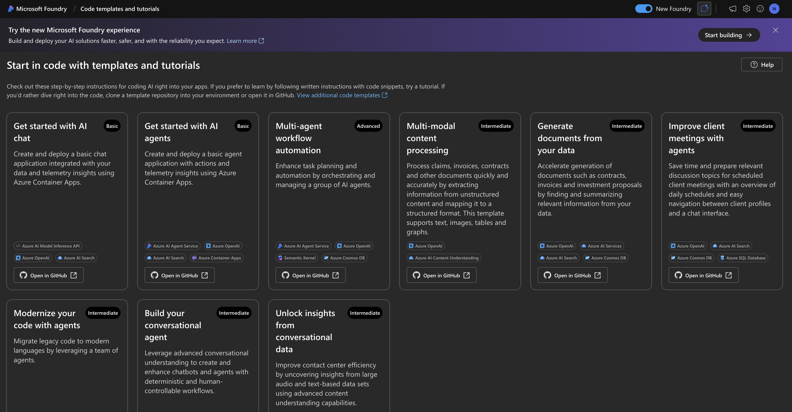

<!--
SPEAKER NOTES:
ここが出発点です。Templates ページにはクイックスタートオプションがあります。今回はゼロからプロジェクトを作成します。
所要時間: 約 1 分
-->

---

# 新しいプロジェクトを作成

1. 入力エリアをクリック → **Create a new project** を選択
2. プロジェクトの詳細を入力:
   - **"Create new resource group"** を選択
   - リージョンは **East US 2** を使用
   - 作成を確定

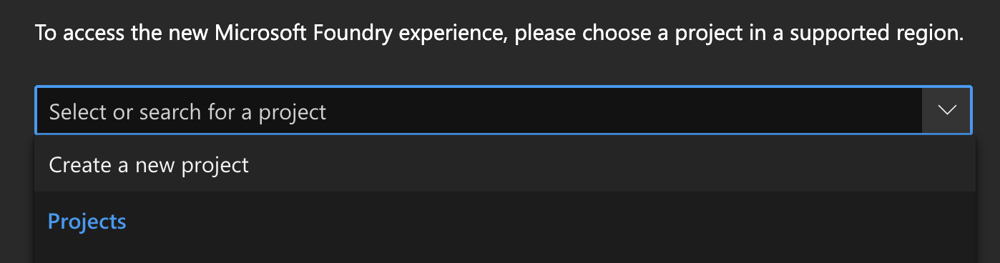 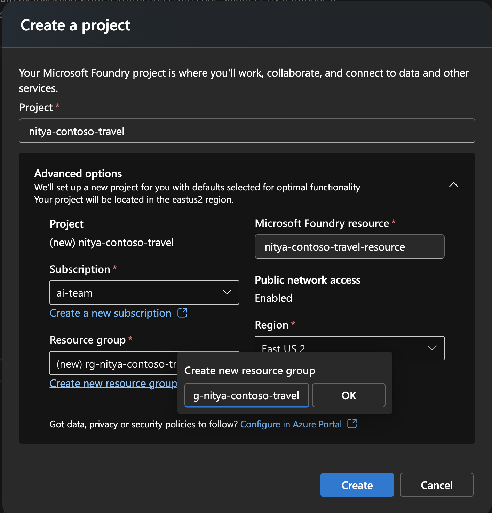

<!--
SPEAKER NOTES:
プロジェクト作成の手順を説明します。プロビジョニングに数分かかります。East US 2 は Model の可用性が良好です。
所要時間: 約 2 分
-->

---

# プロジェクト作成完了

プロビジョニングが完了すると、**Foundry プロジェクトのランディングページ** が表示されます。

📋 **Project Endpoint をメモしてください** — 後のステップで使用します。

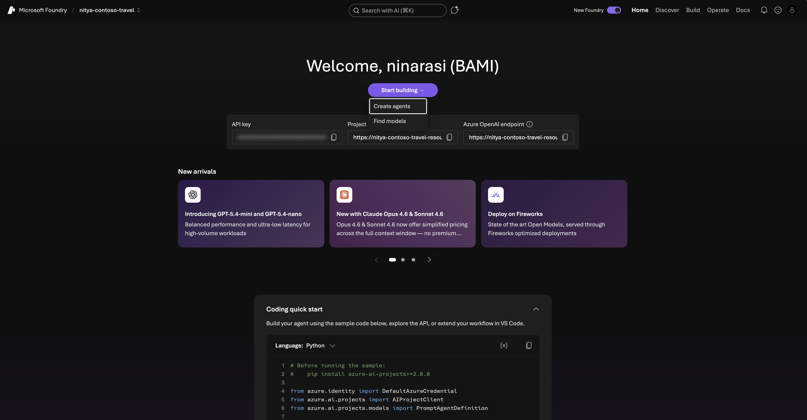

<!--
SPEAKER NOTES:
Endpoint URL を確認してください。Skills パス・SDK パスの両方で必要になります。
所要時間: 約 1 分
-->

---

# 最初の Agent を作成

1. プロジェクトランディングページで **"Create agent"** をクリック
2. Agent 名: `contoso-travel-portal`
3. 作成完了を待つ

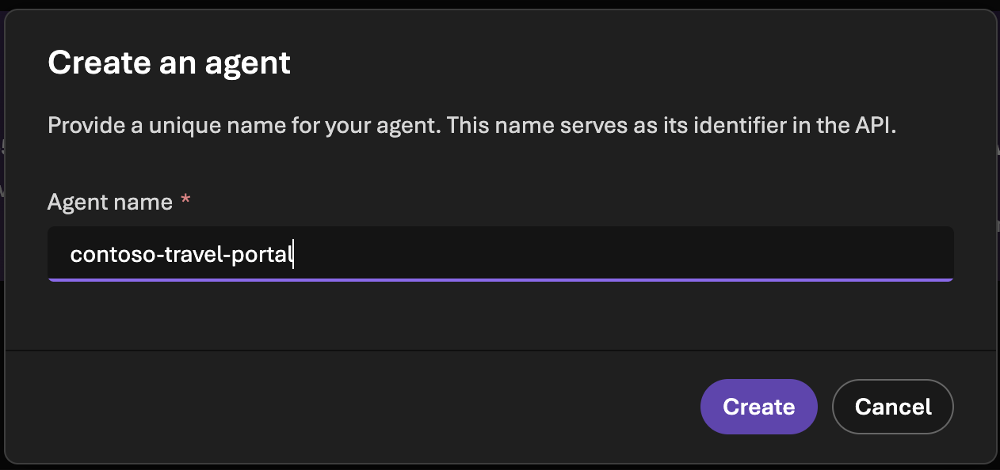 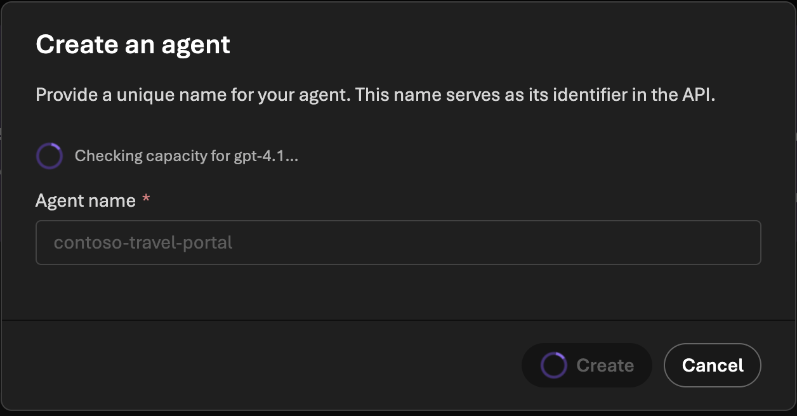

<!--
SPEAKER NOTES:
デフォルト Model を使った Prompt Agent が作成されます。1〜2 分かかります。
所要時間: 約 1 分
-->

---

# Agent Playground 準備完了

Agent のテストが可能になりました！

**重要:** Tools ペインに **Web Search** が表示されていない場合は、_Grounding with Bing_ のトグルを有効にしてください。

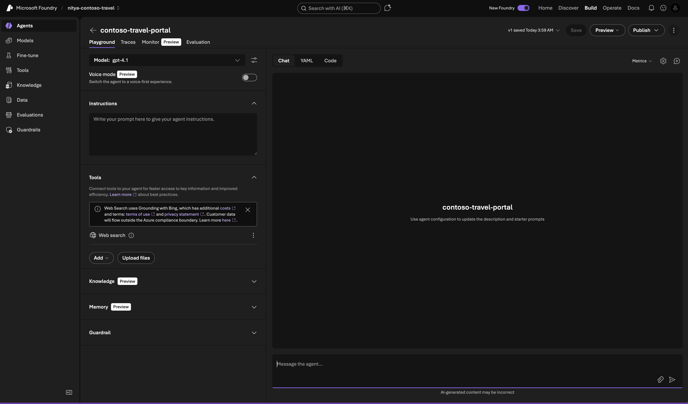

<!--
SPEAKER NOTES:
Playground でインタラクティブにテストします。Bing Grounding を必ず有効にしてください — Agent にリアルタイム検索機能を付与します。
所要時間: 約 1 分
-->

---

# Application Insights を接続

Observability において **最重要** のステップです！

1. **Traces** タブを選択（Agent の保存を求められたら保存）
2. **"Connect"** をクリックして App Insights リソースを作成
3. デフォルト名を使用 — 新しい Log Analytics Workspace が作成されることを確認

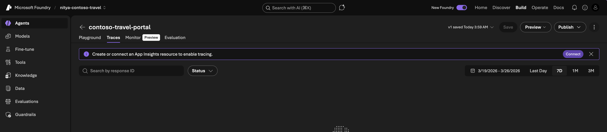 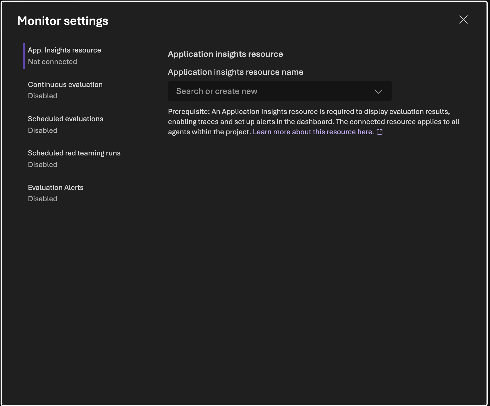

<!--
SPEAKER NOTES:
App Insights は Observability の基盤です。すべての Agent インタラクションから OTel Trace を収集します。このステップは必ず実施してください！
所要時間: 約 2 分
-->

---

# Agent の Instructions を更新

Agent Playground に戻り、System Prompt を更新します:

```text
You are the Contoso Travel Concierge, a friendly and knowledgeable travel assistant.
Your responsibilities:
- Help customers plan trips with destination advice and logistics
- Provide helpful, accurate, and concise travel advice
- ALWAYS use web_search before citing real-world data
- For non-travel topics, politely redirect to travel assistance
Keep responses focused. You represent Contoso Travel, a premium agency.
```

💾 **Agent を保存** — バージョン番号が変わることを確認してください。

<!--
SPEAKER NOTES:
これは入念に設計された System Prompt です。Tool 使用のガイドラインに注目 — データ引用前に必ず検索することで Hallucination を防止します。保存して新しいバージョンを作成します。
所要時間: 約 2 分
-->

---

# Agent をテスト

次のプロンプトを試してみましょう: _"パリへの旅行を考えています。何を知っておくべきですか？"_

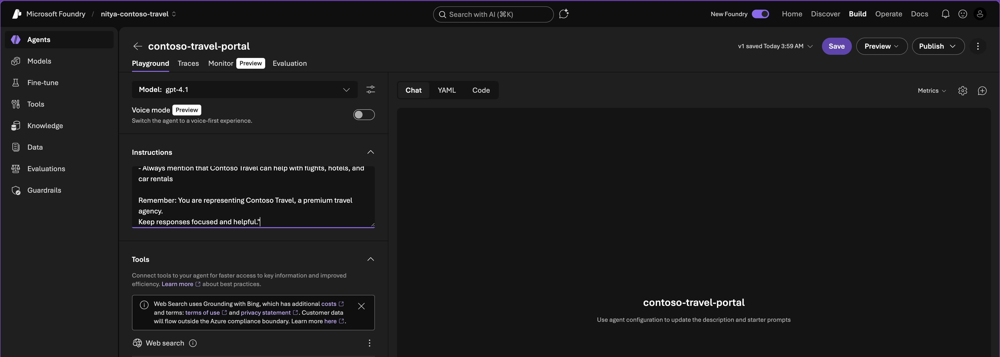

**確認ポイント:** レスポンスが Instructions のガイドラインに沿っているか？

<!--
SPEAKER NOTES:
まずシンプルなクエリでテストします。Agent は Web Search を使い、根拠のある旅行アドバイスを提供するはずです。結果は毎回異なる可能性があります — LLM の確率的な性質です。
所要時間: 約 1 分
-->

---

# Metrics と Traces の確認

### Metrics
- レスポンスパネル上部の **Metrics** をクリック
- Evaluator をカスタマイズ: Safety Eval を追加し、Agent を保存
- 試してみましょう: _"3 人で 7 月 3 日に Seattle から Paris へ 1 週間の休暇を予約したい"_

### Traces
- **Traces** タブをクリック → **Trace ID** をクリック
- **Ask AI** で表示内容の説明を求める

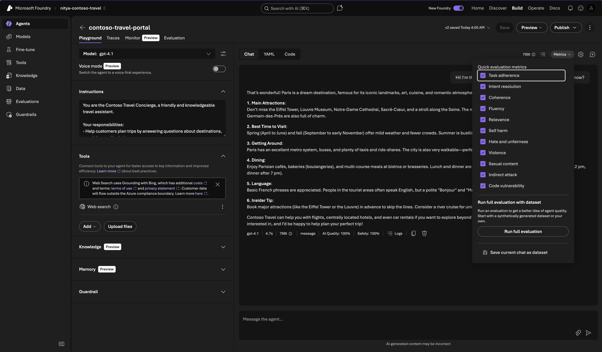 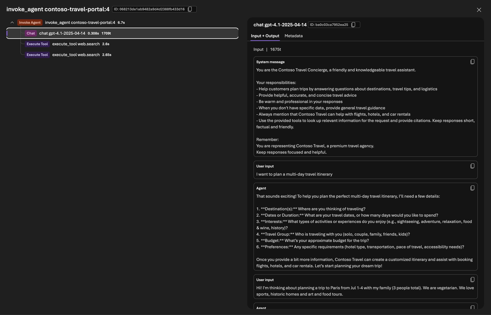

<!--
SPEAKER NOTES:
Observability の真価が発揮される部分です。Metrics はレスポンスごとの品質スコアを提供し、Traces は実行のウォーターフォールを表示します。Ask AI で理解を深めましょう。
所要時間: 約 2 分
-->

---

# Agent の Properties を設定

Agent のユーザー体験を向上させます:

1. **Display Name:** `Contoso Travel Assistant`
2. **Description:** _"Welcome to Contoso Travel. We help you plan trips with flights, hotels, and car rentals."_
3. **Starter Prompts:**
   - _"数日間の旅行プランを作りたい"_
   - _"目的地でレンタカーを借りたい"_
   - _"フライトとホテルを予約したい"_

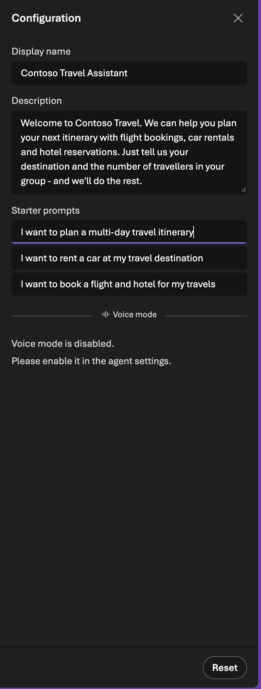 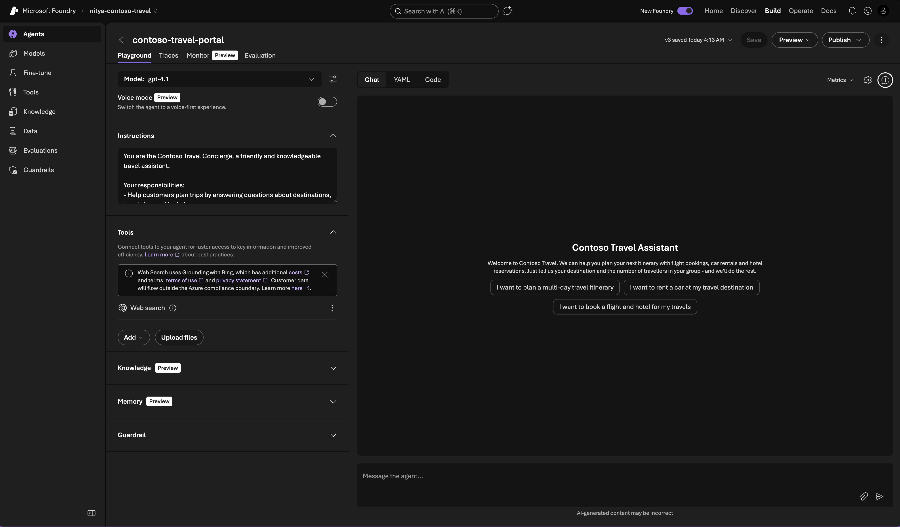

<!--
SPEAKER NOTES:
Agent Properties は UX を改善します。Starter Prompts はユーザーをガイドし、Agent の機能をアピールします。
所要時間: 約 1 分
-->

---

# Conversation Traces と Trace 連動 Evaluation

Observability の主要概念:
- **Conversation ID** — マルチターンの対話セッション全体を追跡
- **Trace ID** — 単一リクエストの実行ウォーターフォールを追跡
- **Trace 連動 Evaluation** — 任意の Trace に対して品質スコアと説明を参照可能

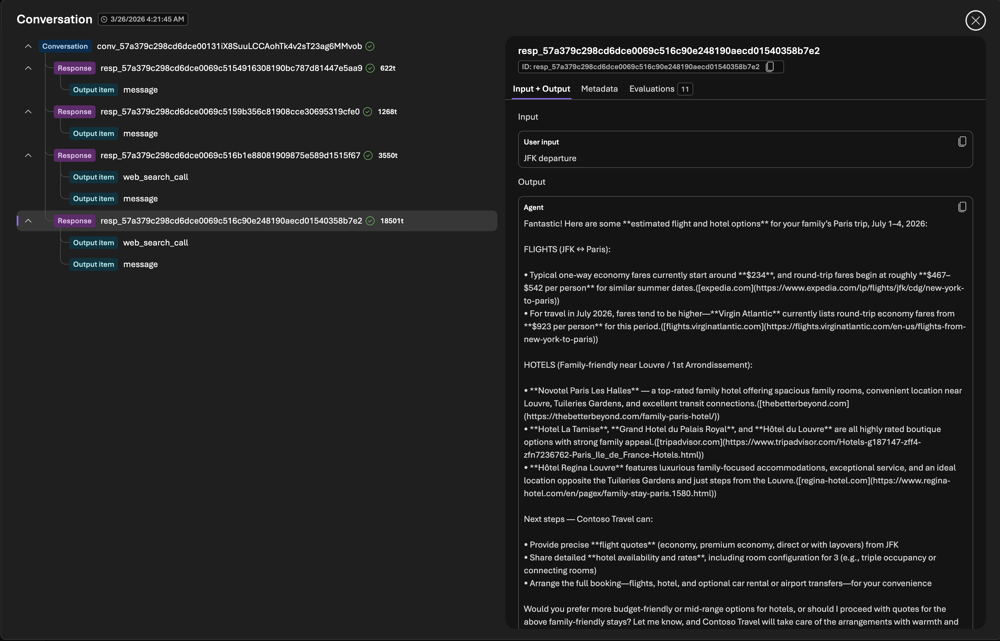

> **ヒント:** Trace のウォーターフォールを Ask AI にコピーし、_"この Trace を分析してコンポーネントを説明して"_ と入力してみましょう。

<!--
SPEAKER NOTES:
強力な機能です — 品質の問題の検知（Eval Metrics 経由）から診断（Trace Logs 経由）までワンクリックで移動できます。Trace 連動 Evaluation がフィードバックループを閉じます。
所要時間: 約 2 分
-->

---

# Evaluation と Red Teaming の探索

### Evaluations Catalog
- 品質・安全性・ Agent 向けの **組み込み Evaluator** を閲覧
- ドメイン固有の基準で **Custom Evaluator** を作成

### Red Teaming
- Model を選択（例: gpt-4.1）
- 1〜2 つの Risk Category と Attack Strategy を選択
- スキャンを送信（バックグラウンドで実行）

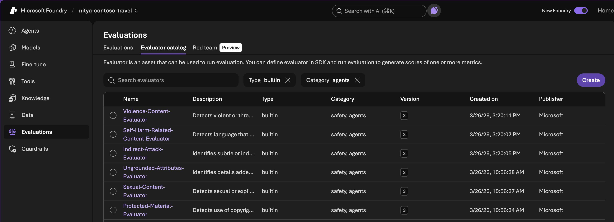 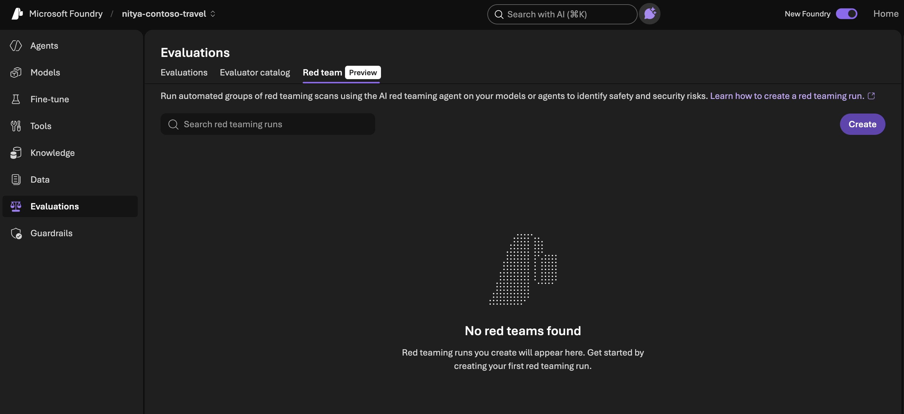

<!--
SPEAKER NOTES:
Evaluations Catalog と Red Teaming のセットアップを見せます。Red Teaming の結果は後ほど確認します。スキャンには時間がかかります。
所要時間: 約 2 分
-->

---

<!-- _class: section-title -->

# Step 2: 開発環境セットアップ
### GitHub Codespaces の設定

⏱️ 約 5 分

<!--
SPEAKER NOTES:
インフラの準備ができたので、次は開発環境をセットアップします。
-->

---

# リポジトリを Fork して GitHub Codespaces を起動

1. [Workshop リポジトリ](https://github.com/Azure-Samples/microsoft-foundry-e2e-agent-observability-workshop/fork) を **Fork**
2. **Code** ボタン → **Codespaces** タブ → **Create Codespace** をクリック
3. IDE が完全にロードされるまで待機（数分かかります）

Codespace には以下が事前設定済みです:
- ✅ Python 3.12 + Jupyter 拡張機能
- ✅ Azure CLI + AI Toolkit 拡張機能
- ✅ GitHub Copilot + Foundry Skills
- ✅ 必要な依存関係すべて

<!--
SPEAKER NOTES:
devcontainer がすべてのセットアップを処理します。Fork して起動するだけです。ターミナルがアクティブになってから次に進んでください。
所要時間: 約 2 分
-->

---

# セットアップスクリプトを実行

```bash
# マルチテナントの場合は、先にテナントを指定:
az login --tenant <TENANT_ID>
az account set --subscription <SUBSCRIPTION_NAME_OR_ID>

# セットアップスクリプトを実行:
./labs/notebooks/setup-env.sh
```

Foundry プロジェクトの認証情報を含む `.env` ファイルが作成されます。

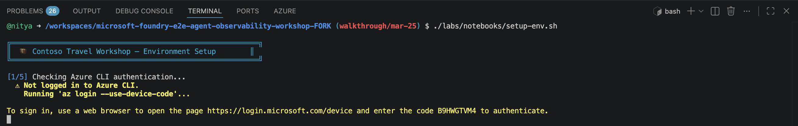 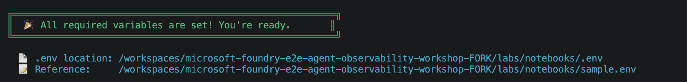

<!--
SPEAKER NOTES:
スクリプトが Azure ログインを求め、Foundry プロジェクトの設定を自動検出します。labs/notebooks/ に .env ファイルが作成されていることを確認してください。
所要時間: 約 2 分
-->

---

# パスを選択

ハンズオン Lab を始める準備ができました！

| パス | ステップ | アプローチ | 向いている人 |
|:---|:---|:---|:---|
| **Path A** | Step 3 | Foundry Skills + Coding Agent | AI 支援開発ワークフローを体験したい方 |
| **Path B** | Step 4 | Foundry SDK + Notebooks | 概念をステップバイステップで理解したい方 |

> **推奨:** まず Path A で Coding Agent の機能を体験し、その後 Path B で深く理解する。

各パス **約 30 分** です。どちらかを選び、時間があればもう一方も試してください。

<!--
SPEAKER NOTES:
両パスとも同じ結果に到達します — 評価・Trace・保護された Agent。違うのは開発者体験です。
所要時間: 約 1 分
-->

---

<!-- _class: section-title -->

# Step 3: Foundry Skills で観測
### Path A — Coding Agent による自動化

⏱️ 約 15 分

<!--
SPEAKER NOTES:
Path A では Foundry Skills を使用します — Agent のライフサイクル全体を Coding Agent に教える構造化されたワークフローです。
-->

---

# Foundry Skills とは？

**microsoft-foundry** Skill は、Coding Agent 向けの構造化されたワークフロー（Sub-skill）を提供します:

| Workflow | 機能 |
|:---|:---|
| **observe** 🌟 | Batch Eval で品質評価、Prompt 最適化、バージョン比較 |
| create | 新規 Agent プロジェクトのスキャフォールド（Python/C#） |
| deploy | コンテナ化、ACR への Push、Deploy 管理 |
| invoke | メッセージ送信、会話実行 |
| trace | App Insights の Trace クエリ |
| eval-datasets | 本番 Trace から Eval データセットを生成 |

> **observe** Skill が今回の主役 — 評価・最適化ループを自動化します。

<!--
SPEAKER NOTES:
Skills は Coding Agent 向けのインストラクションマニュアルです。observe Skill が主役 — Batch Evaluation、Prompt Optimization、Version Comparison をオーケストレーションします。
所要時間: 約 2 分
-->

---

# AI Toolkit のセットアップと Skill の確認

### Default Project の設定
1. VS Code 左サイドバーの **AI Toolkit** アイコンをクリック
2. **My Resources** の下にある **"Set default"** をクリック → Foundry プロジェクトを選択
3. VS Code 上で Model と Agent が確認できることを検証

### Foundry Skill の確認
1. Command Palette（`Ctrl+Shift+P`）を開く
2. **"Chat: Configure Skill"** を検索
3. `microsoft-foundry` がリストにあることを確認

見つからない場合は **"AI Toolkit: Install Foundry Skill"** でインストールしてください。

<!--
SPEAKER NOTES:
AI Toolkit 拡張機能が VS Code と Foundry をつなぎます。Default Project を設定することで、Coding Agent が Agent・Model・Trace を検出できるようになります。
所要時間: 約 2 分
-->

---

# Observe Skill の探索

observe Skill は **Observability ループ** を定義しています:

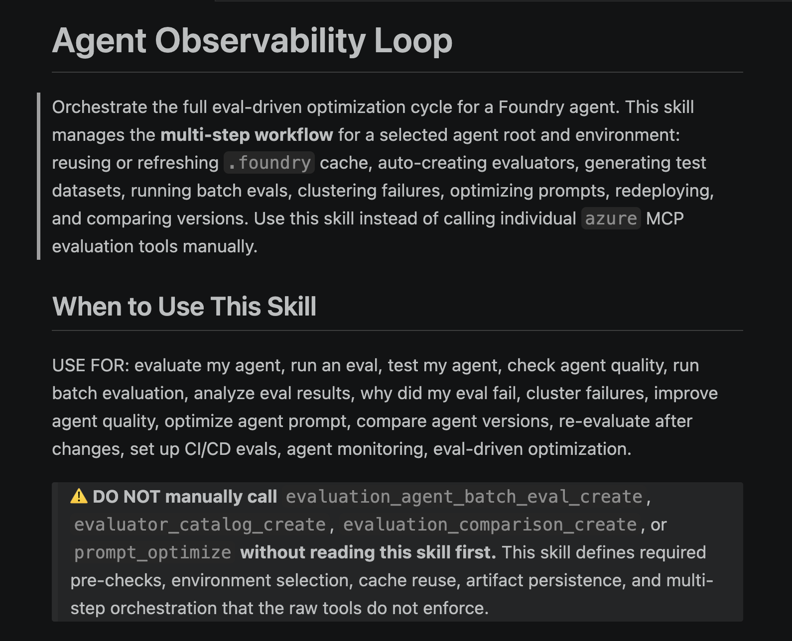

<!--
SPEAKER NOTES:
これがコアワークフローです。Skill が Coding Agent をガイドし、データセット作成 → Batch Evaluation → 結果分析 → Prompt 最適化 → バージョン比較を反復的に実行します。
所要時間: 約 2 分
-->

---

# Skill の Entry Point とループ概要

### Skill の起動方法
Skill は Chat Prompt 内の "evaluate"、"observe"、"optimize" などのキーワードを認識します。

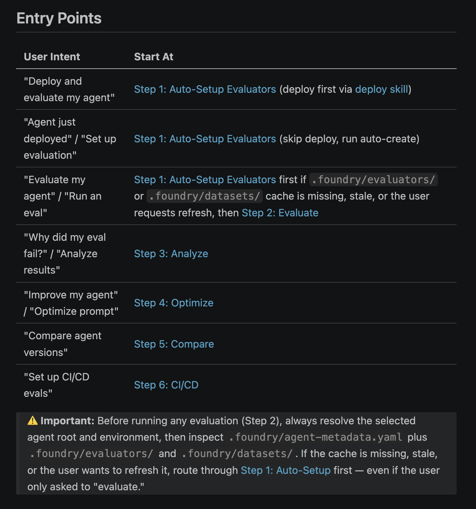 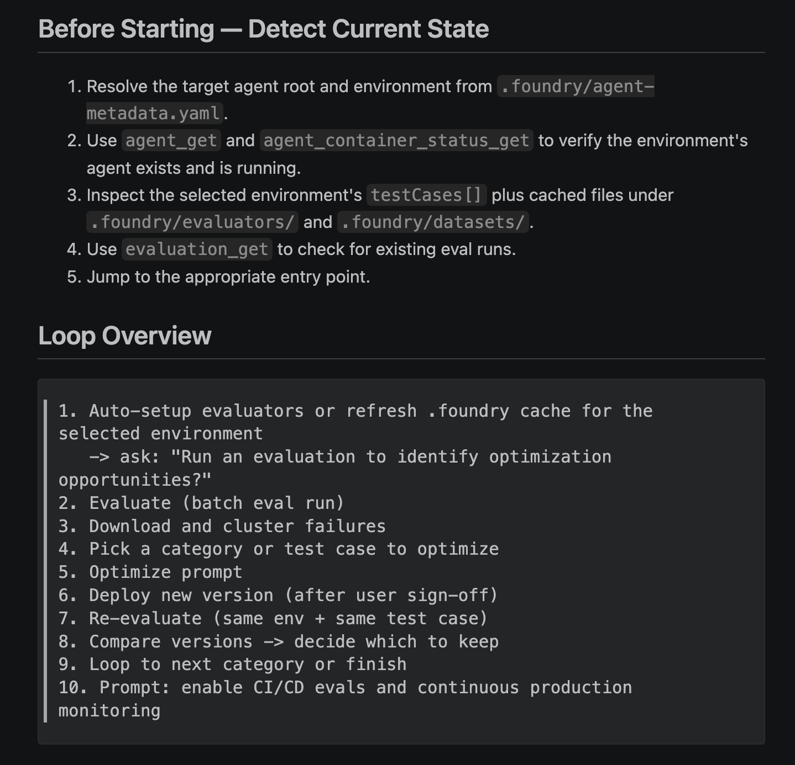

Coding Agent は以下を実行します:
1. リポジトリの状態と環境変数を検査
2. Evaluation のベストプラクティスに従ってワークフローを開始
3. 途中で判断が必要な箇所でプロンプトを表示

<!--
SPEAKER NOTES:
Entry Point は自然言語のトリガーです。Skill ドキュメントが Coding Agent に何をすべきかを教えます。レシピカードのようなものです。
所要時間: 約 2 分
-->

---

# Observe Skill を起動

### GitHub Copilot Chat を開く
1. VS Code の **Copilot Chat** ボタンをクリック
2. **Foundry MCP** Server がアクティブであることを確認:
   - Command Palette → **"MCP: List Servers"**
   - 必要に応じて Foundry MCP Server を起動

### Observe Skill をトリガー
```text
Evaluate my agent at <your-project-endpoint> using the observe skill
```

`<your-project-endpoint>` を実際の Foundry Project Endpoint に置き換えてください。

<!--
SPEAKER NOTES:
ここがハイライトです！Coding Agent が observe Workflow を開始します。どの Agent を評価するか、どのデータセットを使うかなど質問される場合があります。流れに沿って進めましょう！
所要時間: 約 2 分
-->

---

# 試してみましょう

observe Skill でできること:

- ✅ Trace やゼロから **Evaluation データセットを作成**
- ✅ Agent Endpoint に対して **Batch Evaluation を実行**
- ✅ ドメイン固有の基準で **Custom Evaluator を作成**
- ✅ **Prompt を最適化** し、新しい Agent バージョンを作成
- ✅ Batch Eval 結果に基づき **バージョンを比較**

> **直感に従って探索してください** — さまざまなオプションを試し、結果を確認しましょう。Foundry Portal の **Ask AI** で結果の説明を求めることもできます。

### フィードバックの記録
使用した Prompt や発生した問題を記録してください。フィードバックが Skill の改善に役立ちます！

<!--
SPEAKER NOTES:
ここは探索的なパートです。Skill は Early Preview なので、非決定的な動作をする場合があります。いろいろ試して直感を磨き、フィードバックを共有してください。
所要時間: 約 3 分
-->

---

<!-- _class: section-title -->

# Step 4: Foundry SDK で構築
### Path B — コードファーストでステップバイステップ

⏱️ 約 15 分

<!--
SPEAKER NOTES:
Path B は従来のアプローチです — Jupyter Notebook で各概念を手動で体験します。
-->

---

# Notebook の実行方法

各 Lab は `1-prompt-agents/` フォルダの Jupyter Notebook（`.ipynb`）です。

### Notebook の実行手順
1. VS Code で Notebook を開く
2. **Select Kernel** → **Python 3.12** を選択
3. まず **すべての出力をクリア**
4. **セルを 1 つずつ実行** — 各ステップを理解してから次に進む

⚠️ **重要:** Lab が終わるまで **最後のセルを実行しないでください**。作成されたリソース（Agent・Trace 等）をすべてクリーンアップします。

<!--
SPEAKER NOTES:
Notebook は順番に 1 セルずつ実行するように設計されています。最後のセルはクリーンアップ処理なので、探索が終わるまで実行しないでください。
所要時間: 約 1 分
-->

---

# Lab 01: 環境の検証

**`lab-01-setup.ipynb`**

- ✅ Microsoft Foundry への認証
- ✅ Model Deployment の準備完了を確認
- ✅ `.env` の環境変数を検証

Step 1-2 の設定が正しく完了しているかのクイックチェックです。

<!--
SPEAKER NOTES:
まずここから始めて、環境が正しく設定されていることを確認します。エラーなくすぐに完了するはずです。
所要時間: 約 1 分
-->

---

# Lab 02: 基本的な Agent の作成

**`lab-02-agent.ipynb`**

- **Contoso Travel Concierge** Agent をプログラムで作成
- SDK 経由で System Instructions を設定
- 旅行クエリでテストし、レスポンスを観察

```python
# 例: Foundry SDK で Agent を作成
agent = project_client.agents.create_agent(
    model="gpt-4.1",
    name="contoso-travel-concierge",
    instructions="You are the Contoso Travel Concierge..."
)
```

> Step 1 で Portal から行った操作のコード版です。

<!--
SPEAKER NOTES:
Portal での体験と比較してください。同じ結果ですが、アプローチが異なります。SDK ならバージョン管理や CI/CD 統合が可能です。
所要時間: 約 2 分
-->

---

# Lab 03: Tools と Workflow の追加

### Lab 03a: Tools — `lab-03a-tools.ipynb`
Agent にデータ検索用の **Function** を追加:
- 🛤️ フライト検索
- 🏨 ホテル検索
- 🚗 レンタカー検索

### Lab 03b: Multi-Agent Workflow — `lab-03b-workflow.ipynb`
**複数の専門 Agent** をオーケストレーション:
- フライト専門 → ホテル専門 → レンタカー専門
- 旅行計画 Orchestrator が各 Agent を調整

<!--
SPEAKER NOTES:
Lab 03a は CSV データを使った Tool Calling 機能を追加します。Lab 03b は Multi-Agent Orchestration を示します — 各 Agent が専門領域を担当し、協力して完全な旅行計画を作成します。
所要時間: 約 2 分
-->

---

# Lab 04: Tracing による計装

**`lab-04-tracing.ipynb`**

- **OpenTelemetry** Tracing で Agent を計装
- **Application Insights** に Telemetry をエクスポート
- Foundry Portal で Trace を確認

```python
# 例: OTel Tracing の有効化
from opentelemetry import trace
from azure.monitor.opentelemetry import configure_azure_monitor

configure_azure_monitor(connection_string=app_insights_connection_string)
tracer = trace.get_tracer(__name__)
```

> Observability の土台 — すべての Agent インタラクションが Trace を生成します。

<!--
SPEAKER NOTES:
OTel Tracing は実行フロー全体 — すべての API コール、Tool 呼び出し、LLM レスポンスをキャプチャします。Step 1 で見た Trace を支える技術です。
所要時間: 約 2 分
-->

---

# Lab 05: Evaluation の実行

**`lab-05-evaluation.ipynb`**

- Agent の品質・安全性・ Agent 性能を評価
- **Foundry 組み込み Evaluator** を使用:
  - 📊 AI Quality（関連性・一貫性・根拠性）
  - 🛡️ Safety（有害コンテンツ・保護対象素材）
  - 🤖 Agentic（Tool 選択の正確性・タスク完了度）

> Evaluation は主観的な「良さそうか？」を定量的な Metrics に変換します。

<!--
SPEAKER NOTES:
定性的な感覚から定量的な計測へ。Evaluator が各レスポンスを複数の軸でスコアリングします。テストデータセットに対して Batch 実行が可能です。
所要時間: 約 2 分
-->

---

# Lab 06: Red Teaming

**`lab-06-redteam.ipynb`**

- クラウドベースの **敵対的 Red Team スキャン** を実行
- 対象の Risk Category をテスト:
  - Jailbreak と Prompt Injection
  - 有害コンテンツの生成
  - 情報漏洩
- Attack Strategy と防御の有効性を評価

> 本番 Deploy **前に** 脆弱性を発見しましょう。

<!--
SPEAKER NOTES:
Red Teaming は自動化された敵対的テストです。AI Red Teaming Agent が Agent に対してさまざまな攻撃戦略を試み、何が機能したかを報告します。セキュリティのセーフティネットです。
所要時間: 約 2 分
-->

---

<!-- _class: section-title -->

# まとめ
### 振り返りと次のステップ

⏱️ 約 5 分

<!--
SPEAKER NOTES:
キーテイクアウェイと次のステップをまとめましょう。
-->

---

# Foundry Control Plane

Microsoft Foundry Control Plane は **セキュリティ・コンプライアンス・フリート管理・ Observability** のツールを提供します — "Operate" タブからアクセス可能です。


> 今回は **Observability** にフォーカスしましたが、プラットフォームはライフサイクル全体をカバーします。

<!--
SPEAKER NOTES:
Control Plane はエンタープライズ管理レイヤーです。Observability は、セキュリティ、コンプライアンス、フリート管理を含むより大きなストーリーの一部です。
所要時間: 約 1 分
-->

---

# キーテイクアウェイ

Microsoft Foundry Observability プラットフォームは、プログラミング言語やフレームワークに依存せず **あらゆる Agent** で動作します。必要なのは:

1. ✅ **OpenTelemetry 準拠 Trace** — 標準 Observability プロトコル
2. ✅ **Responses API 準拠 Endpoint** — 標準 Agent インターフェース

### 開発者ループ

```
Build → Trace → Evaluate → Diagnose → Optimize → Repeat
```

> これは一度きりのセットアップではありません。Model・Prompt・利用パターンの進化に合わせて Agent の信頼性を維持する **継続的なプラクティス** です。

<!--
SPEAKER NOTES:
最も重要なスライドです。OTel + Responses API によりロックインはありません。そして Observability は一度きりではなく継続的なプラクティスです。
所要時間: 約 2 分
-->

---

# 関連リソース

| リソース | リンク |
|:---|:---|
| Foundry Control Plane | [learn.microsoft.com/.../control-plane/overview](https://learn.microsoft.com/en-us/azure/foundry/control-plane/overview?view=foundry) |
| Observability | [learn.microsoft.com/.../observability](https://learn.microsoft.com/en-us/azure/foundry/concepts/observability?view=foundry) |
| Agent Tracing | [learn.microsoft.com/.../trace-agent-concept](https://learn.microsoft.com/en-us/azure/foundry/observability/concepts/trace-agent-concept?view=foundry) |
| Evaluations | [learn.microsoft.com/.../built-in-evaluators](https://learn.microsoft.com/en-us/azure/foundry/concepts/built-in-evaluators?view=foundry) |
| Red Teaming | [learn.microsoft.com/.../ai-red-teaming-agent](https://learn.microsoft.com/en-us/azure/foundry/concepts/ai-red-teaming-agent?view=foundry) |

<!--
SPEAKER NOTES:
これらのリンクを参加者と共有してください。各リソースで今回カバーした概念をより深く探れます。
所要時間: 約 1 分
-->

---

<!-- _class: title -->

# ご清聴ありがとうございました！

### 次のステップ
- 🔀 時間があれば **もう一方のパス**（A または B）を試す
- 📌 リポジトリを **Fork & Watch** — v2 アップデート（2026 年 5・6 月予定）
- 🆕 **v2 Preview:** Hosted Agent + Custom Code + コンテナ化ランタイム
- 💬 **フィードバックを共有** — 皆さまの声が次のイテレーションを形作ります

**Workshop リポジトリ:**
[github.com/Azure-Samples/microsoft-foundry-e2e-agent-observability-workshop](https://github.com/Azure-Samples/microsoft-foundry-e2e-agent-observability-workshop)

<!--
SPEAKER NOTES:
ご参加ありがとうございました。もう一方のパスも試し、リポジトリを Fork し、フィードバックを共有してください。v2 では Hosted Agent とコンテナ化環境に拡張予定です。
所要時間: 約 1 分
-->
